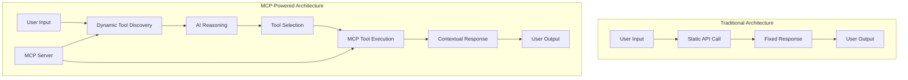
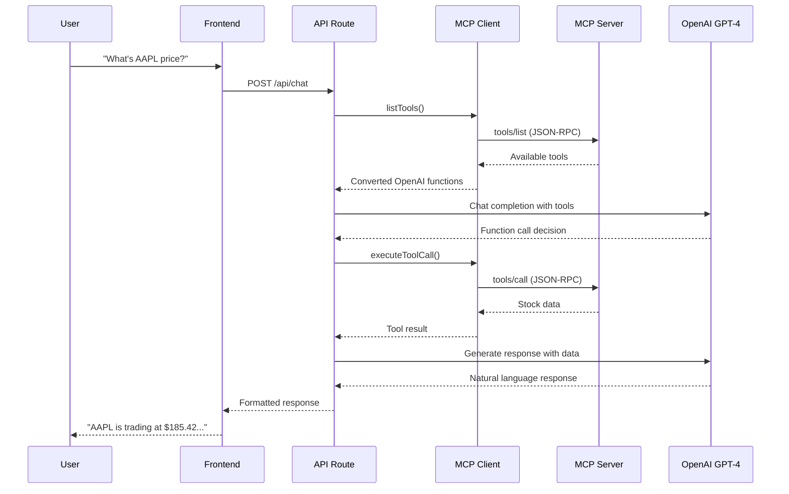
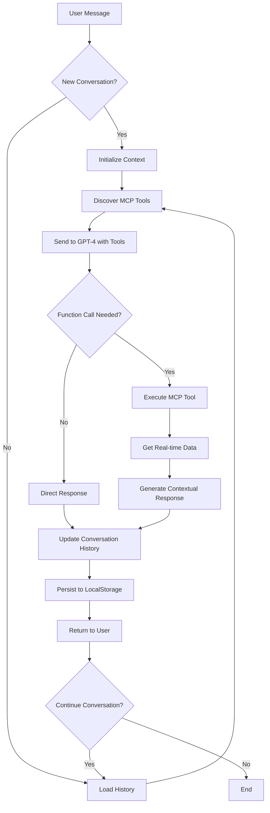
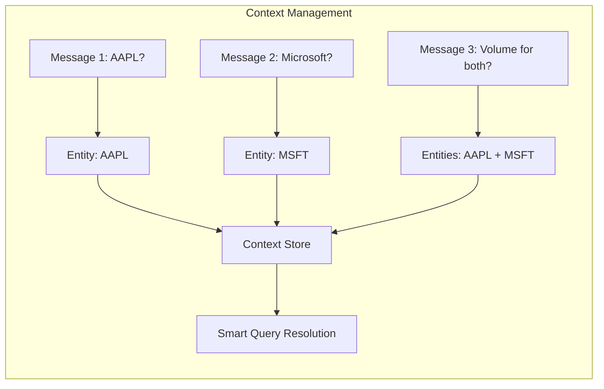
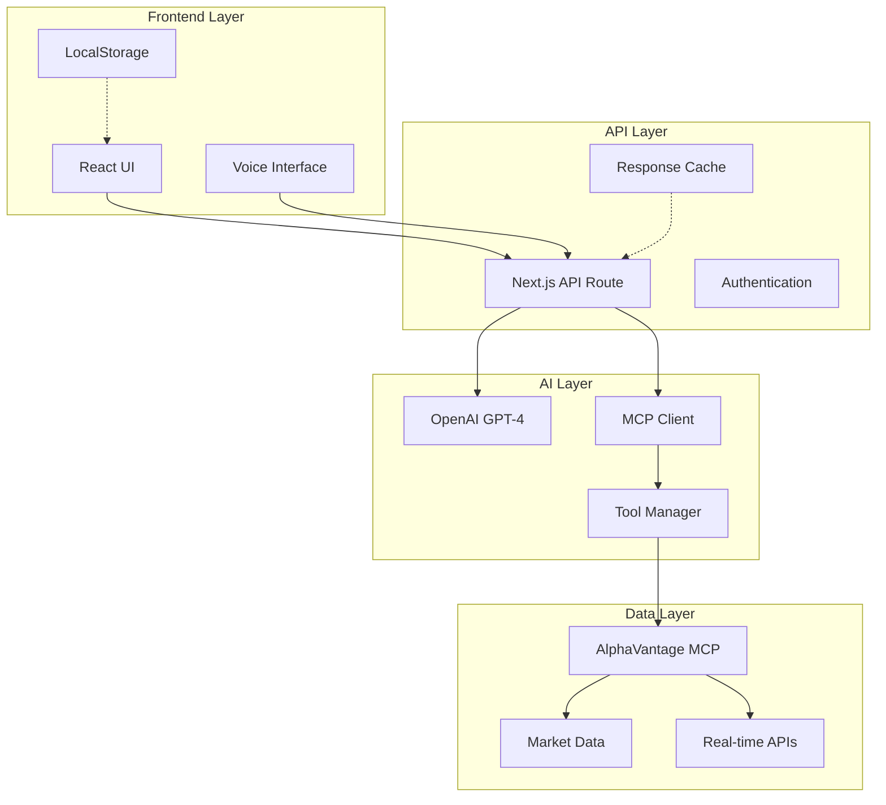
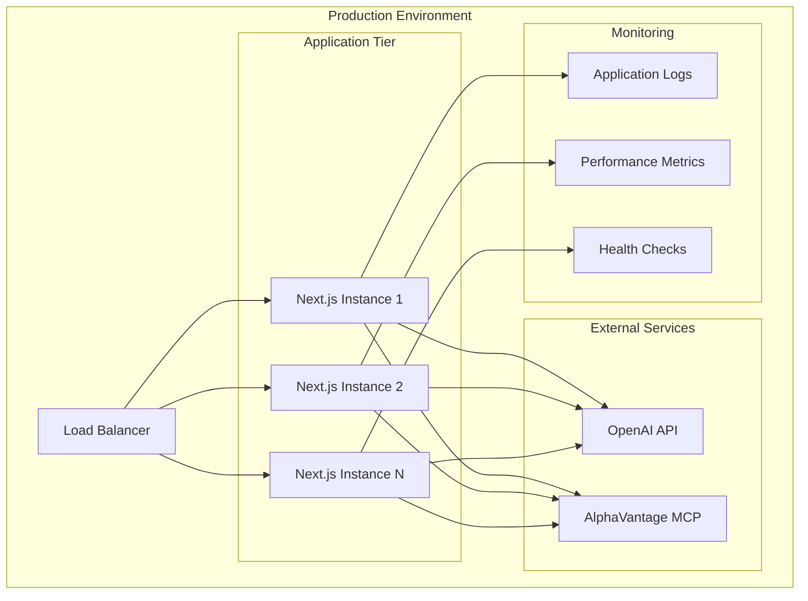

# MCP-Powered AI chatbot Applications

*How to build a production-ready AI chatbot that seamlessly integrates real-time stock data using the Model Context Protocol*


---

## The Challenge: Beyond Simple Chatbots

In the rapidly evolving landscape of AI applications, the gap between basic chatbots and truly intelligent, context-aware agents has never been more apparent. While most financial chatbots rely on static data or simple API calls, I set out to build something fundamentally different: an **agentic AI system** that could dynamically discover, understand, and utilize external tools in real-time.

The result? A sophisticated stock market chatbot that doesn't just answer questions—it actively reasons about financial data, maintains contextual conversations, and adapts its capabilities on the fly through the **Model Context Protocol (MCP)**.

## The Architecture: Where MCP Meets Modern AI

### What Makes This Different

Traditional chatbot architectures follow a rigid pattern: user input → predefined API call → formatted response. This approach breaks down when you need:

- **Dynamic tool discovery** - What if new data sources become available?
- **Contextual reasoning** - How do you maintain conversation state across complex queries?
- **Real-time adaptability** - Can your system learn new capabilities without redeployment?

### Traditional vs MCP Architecture



My solution leverages the **Model Context Protocol** to create a truly agentic system that addresses all these challenges.

### The MCP Advantage

```typescript
// Traditional approach - rigid and limited
const getStockPrice = async (symbol: string) => {
  const response = await fetch(`/api/stocks/${symbol}`);
  return response.json();
};

// MCP approach - dynamic and extensible
const mcpClient = new MCPClient();
const availableTools = await mcpClient.listTools();
const result = await mcpClient.callTool('get_stock_quote', { symbol });
```

The difference is profound. With MCP, my application:

1. **Discovers tools dynamically** from the AlphaVantage MCP server
2. **Converts MCP tools** to OpenAI function calling format automatically  
3. **Executes tool calls** via standardized JSON-RPC 2.0 protocol
4. **Maintains context** across multiple tool interactions

## Technical Deep Dive: The MCP Integration Layer

### Core MCP Client Implementation

The heart of the system is a custom MCP client that bridges the gap between OpenAI's function calling and the Model Context Protocol:

```typescript
class MCPClient {
  private async discoverTools() {
    const tools = await this.sendRequest('tools/list');
    return tools.map(tool => this.convertToOpenAIFormat(tool));
  }

  private convertToOpenAIFormat(mcpTool: MCPTool): OpenAIFunction {
    return {
      name: mcpTool.name,
      description: mcpTool.description,
      parameters: mcpTool.inputSchema
    };
  }

  async executeToolCall(name: string, args: any) {
    return await this.sendRequest('tools/call', {
      name,
      arguments: args
    });
  }
}
```

### MCP Integration Flow



This abstraction layer enables seamless integration between:
- **OpenAI GPT-4** for natural language understanding and generation
- **AlphaVantage MCP Server** for real-time financial data
- **Custom business logic** for contextual reasoning

### Agentic Conversation Flow



The system implements a sophisticated conversation management pattern:

```typescript
const conversationFlow = async (userMessage: string, history: Message[]) => {
  // 1. Discover available tools dynamically
  const tools = await mcpClient.listTools();
  
  // 2. Let GPT-4 reason about tool usage
  const response = await openai.chat.completions.create({
    model: 'gpt-4o-mini',
    messages: [...history, { role: 'user', content: userMessage }],
    functions: tools,
    function_call: 'auto'
  });

  // 3. Execute tool calls if needed
  if (response.function_call) {
    const toolResult = await mcpClient.executeToolCall(
      response.function_call.name,
      JSON.parse(response.function_call.arguments)
    );
    
    // 4. Generate contextual response with tool data
    return await generateContextualResponse(toolResult, history);
  }
  
  return response.choices[0].message.content;
};
```

## Advanced Features: Beyond Basic Q&A

### Contextual Intelligence



The system maintains sophisticated conversation context, enabling natural follow-up queries:

```
User: "What's Apple's current stock price?"
AI: "Apple (AAPL) is currently trading at $185.42..."

User: "How does that compare to Microsoft?"
AI: "Microsoft (MSFT) is at $378.85, which means it's trading at roughly 2x Apple's price..."

User: "What about the volume for both?"
AI: "Looking at today's volume: AAPL has 45.2M shares traded while MSFT shows 28.7M..."
```

This contextual awareness is achieved through:
- **Conversation history management** with sliding window context
- **Entity extraction** to track mentioned stocks across messages
- **Semantic understanding** of comparative and relational queries

### Real-Time Adaptability

The MCP integration enables the system to adapt to new capabilities without code changes:

```typescript
// New tools are discovered automatically
const newTools = await mcpClient.refreshTools();
// System immediately gains new capabilities
// No redeployment required
```

### Voice-Enabled Interactions

The application includes sophisticated voice capabilities:

```typescript
const voiceHandler = {
  startListening: () => {
    const recognition = new webkitSpeechRecognition();
    recognition.onresult = (event) => {
      const transcript = event.results[0][0].transcript;
      processUserQuery(transcript);
    };
  },
  
  speakResponse: (text: string) => {
    const utterance = new SpeechSynthesisUtterance(text);
    speechSynthesis.speak(utterance);
  }
};
```

## System Architecture Overview



## Performance & Scalability Considerations

### Optimized MCP Communication

The system implements several performance optimizations:

```typescript
// Connection pooling for MCP requests
const mcpPool = new ConnectionPool({
  maxConnections: 10,
  keepAlive: true,
  timeout: 5000
});

// Intelligent caching for tool discovery
const toolCache = new Map();
const getCachedTools = async () => {
  if (!toolCache.has('tools') || isExpired(toolCache.get('tools'))) {
    toolCache.set('tools', await mcpClient.listTools());
  }
  return toolCache.get('tools');
};
```

### Conversation State Management

Efficient state management ensures smooth user experience:

```typescript
// Sliding window context to manage memory
const manageContext = (messages: Message[]) => {
  const MAX_CONTEXT = 10;
  return messages.slice(-MAX_CONTEXT);
};

// LocalStorage persistence for session continuity
const persistConversation = (messages: Message[]) => {
  localStorage.setItem('chatHistory', JSON.stringify(messages));
};
```

## Production Deployment & Monitoring

### Deployment Architecture



The application is designed for cloud-native deployment:

```dockerfile
FROM node:20-alpine
WORKDIR /app
COPY package*.json ./
RUN npm ci --only=production
COPY . .
RUN npm run build
EXPOSE 3000
CMD ["npm", "start"]
```

### Error Handling & Resilience

Robust error handling ensures system reliability:

```typescript
const resilientMCPCall = async (toolName: string, args: any) => {
  const maxRetries = 3;
  let attempt = 0;
  
  while (attempt < maxRetries) {
    try {
      return await mcpClient.callTool(toolName, args);
    } catch (error) {
      attempt++;
      if (attempt === maxRetries) {
        return { error: 'Service temporarily unavailable' };
      }
      await delay(1000 * attempt); // Exponential backoff
    }
  }
};
```

## Key Technical Achievements

### 1. **Seamless MCP Integration**
- Dynamic tool discovery and execution
- Automatic OpenAI function format conversion
- JSON-RPC 2.0 protocol implementation

### 2. **Advanced Conversation Management**
- Contextual query understanding
- Multi-turn conversation state
- Intelligent history management

### 3. **Production-Ready Architecture**
- TypeScript for type safety
- Comprehensive error handling
- Performance optimizations
- Scalable deployment patterns

### 4. **Modern User Experience**
- Real-time voice interactions
- Responsive design with dark mode
- Smooth animations and transitions
- Cross-platform compatibility

## The Future of Agentic AI Applications

This project demonstrates the transformative potential of MCP in building truly intelligent AI applications. By standardizing how AI systems discover and interact with external tools, MCP enables:

- **Composable AI architectures** where capabilities can be mixed and matched
- **Dynamic system evolution** without requiring code changes
- **Standardized integration patterns** across different AI providers and data sources

### What's Next?

The foundation laid here opens doors to exciting possibilities:

- **Multi-modal interactions** combining text, voice, and visual data
- **Collaborative AI agents** that can work together on complex tasks
- **Self-improving systems** that learn and adapt their tool usage over time

## Technical Skills Demonstrated

Through this project, I've showcased expertise in:

**AI & Machine Learning:**
- OpenAI GPT-4 integration and optimization
- Function calling and tool use patterns
- Conversation state management
- Natural language processing

**Modern Web Development:**
- Next.js 16 with React 19
- TypeScript for type-safe development
- TailwindCSS for responsive design
- Progressive Web App features

**Protocol & Integration:**
- Model Context Protocol implementation
- JSON-RPC 2.0 communication
- RESTful API design
- Real-time data integration

**DevOps & Production:**
- Docker containerization
- Environment configuration
- Performance optimization
- Error handling and monitoring

## Conclusion

Building this MCP-powered stock market chatbot has been a journey into the future of AI application development. By leveraging the Model Context Protocol, I've created not just another chatbot, but a glimpse into how AI systems will evolve: dynamic, contextual, and truly intelligent.

The combination of MCP's standardized tool integration, OpenAI's advanced language models, and modern web technologies creates a powerful foundation for the next generation of AI applications. This project proves that with the right architecture and protocols, we can build AI systems that are not just responsive, but genuinely agentic—capable of reasoning, adapting, and growing more capable over time.

---

*Ready to explore the future of AI development? The complete source code and deployment instructions are available in the project repository. Let's build the next generation of intelligent applications together.*

## Connect & Collaborate

Interested in discussing MCP integration, agentic AI development, or modern web architectures? I'm always excited to connect with fellow developers and explore new possibilities in AI application development.

**Technologies Featured:** Next.js • TypeScript • OpenAI GPT-4 • Model Context Protocol • AlphaVantage API • TailwindCSS • React 19